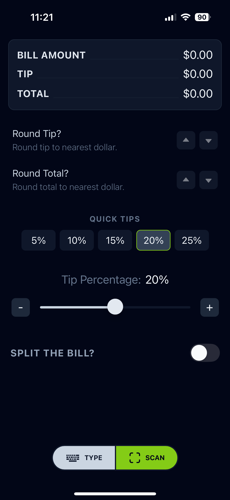
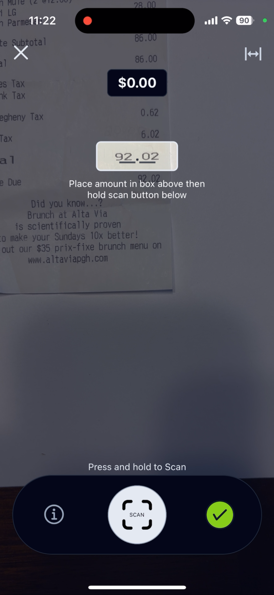
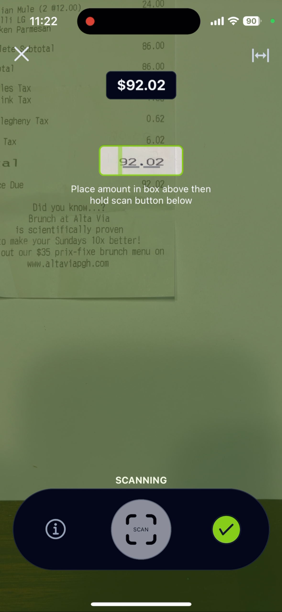
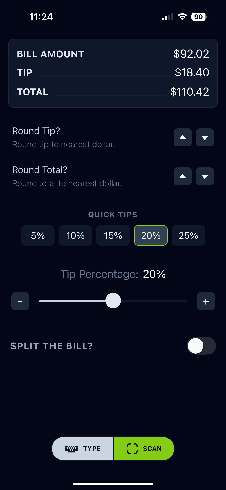
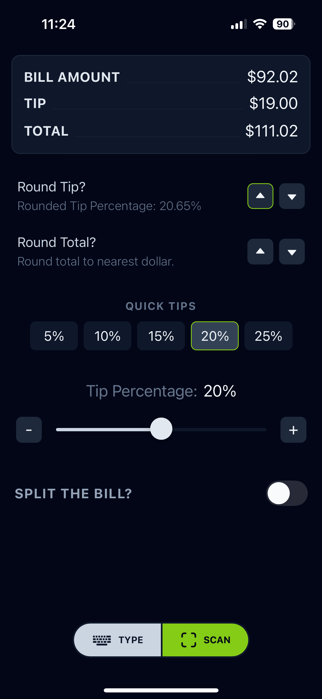
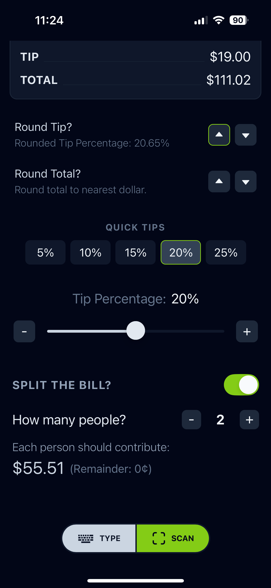

# Welcome to TipAI 

  

 _The Tip Calculator for the AI era._

Built with:
- [React Native](https://reactnative.dev/)
- [Expo](https://docs.expo.dev/)
- [NativeWind](https://www.nativewind.dev/)
- [react-native-ml-kit](https://www.npmjs.com/package/@react-native-ml-kit/text-recognition)

Available soon on Android and IOS.

## Screenshots

  
  
  

 

  
  
  

